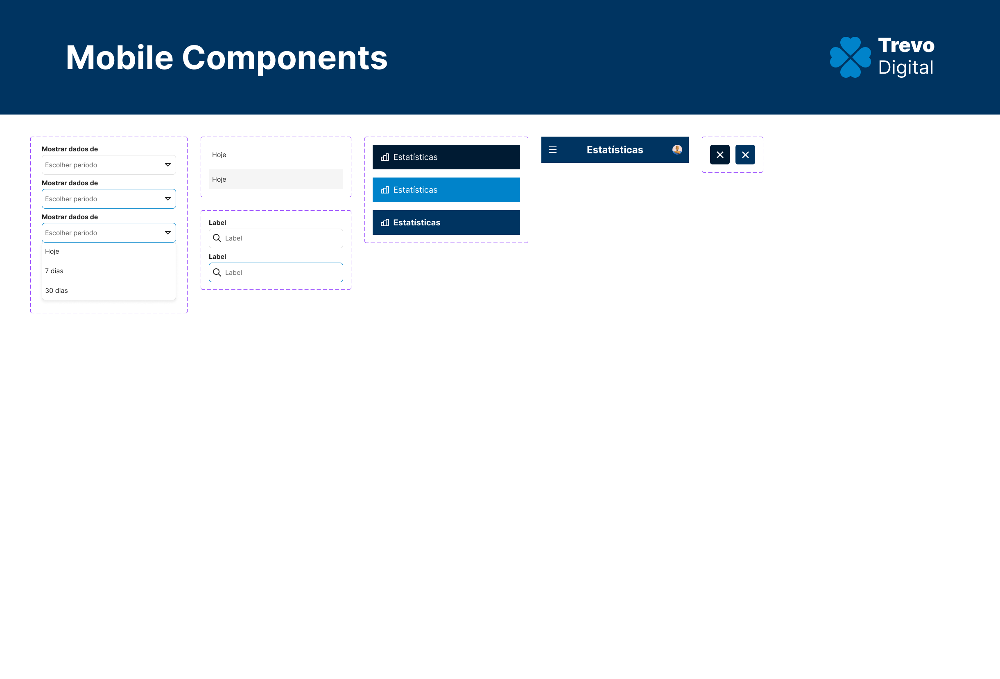
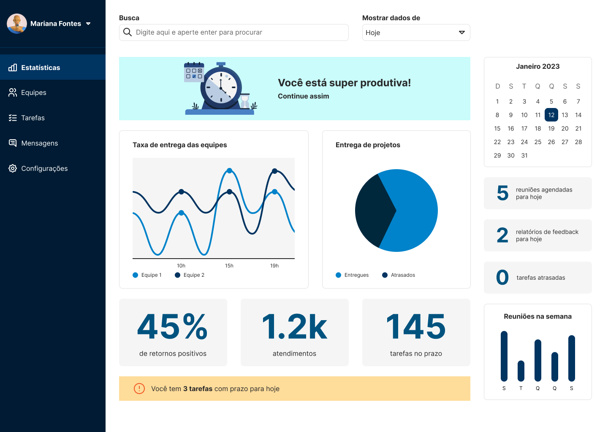
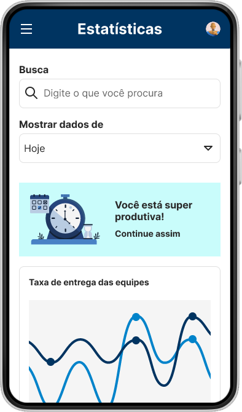
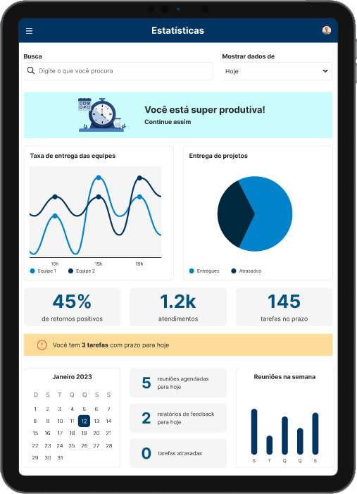

# Desafio Técnico

## Contexto

A empresa Trevo Digital tem clientes em mais de 15 países. Para este desafio, deveria desenvolver um dashboard em versão desktop e mobile, levando em consideração o wireframe e a paleta de cores fornecidos. Também foram dadas 3 opções de diferencial:
- **1-** Propor a versão do dashboard para tablet
- **2-** Usar componentes fluidos no Figma or Adobe XD
- **3-** Criar a proposta de uma página que tenha uma tabela e filtros dinâmicos

### Design System

Para criar o dashboard, organizei os estilos de fonte, cores e espaçamentos, além dos componentes para as versões desktop, mobile e tablet. Usei como referência componentes do Material Design System e do Jota, Design System da Meiuca.
As imagens estão disponíveis na pasta DS.

### Versão Desktop

Para acessar a versão desktop do dashboard, acesse o link: https://www.figma.com/proto/MeHze4aKOa2ifvfmLID4Dt/Desafio-T%C3%A9cnico-Onisys?page-id=0%3A1&node-id=1%3A2&viewport=1173%2C402%2C0.04&scaling=scale-down&starting-point-node-id=1%3A2

### Versão Mobile

Para acessar a versão mobile do dashboard, acesse o link: https://www.figma.com/proto/MeHze4aKOa2ifvfmLID4Dt/Desafio-T%C3%A9cnico-Onisys?page-id=32%3A1903&node-id=32%3A2220&viewport=1694%2C538%2C0.5&scaling=scale-down&starting-point-node-id=32%3A2220

### Versão Tablet

Para acessar a versão tablet do Dashboard, acesse o link: https://www.figma.com/proto/MeHze4aKOa2ifvfmLID4Dt/Desafio-T%C3%A9cnico-Onisys?page-id=38%3A673&node-id=39%3A655&viewport=418%2C406%2C0.25&scaling=scale-down&starting-point-node-id=39%3A655

